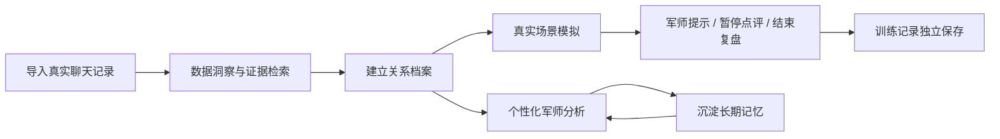
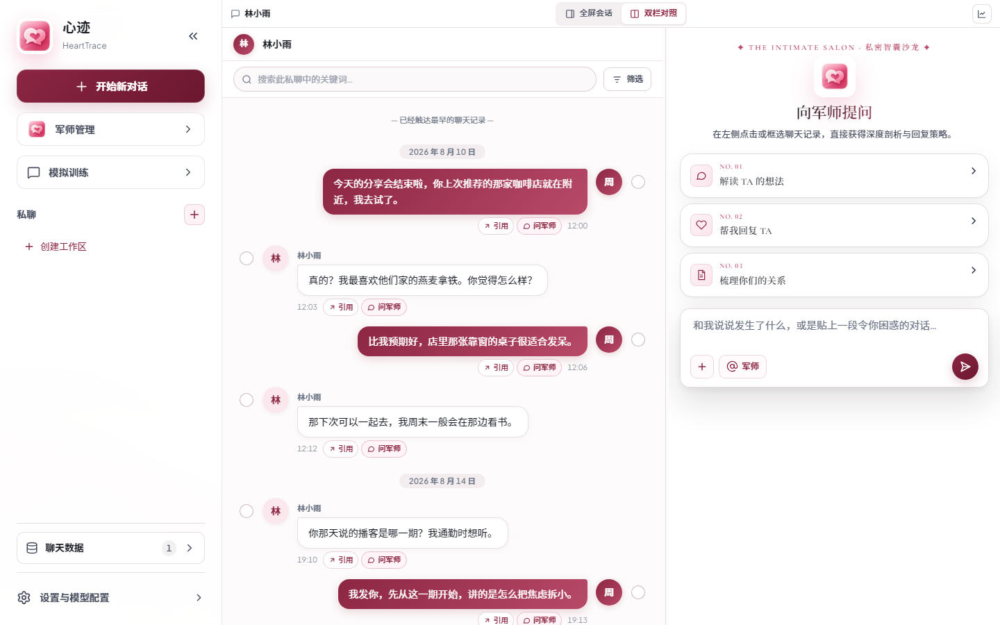
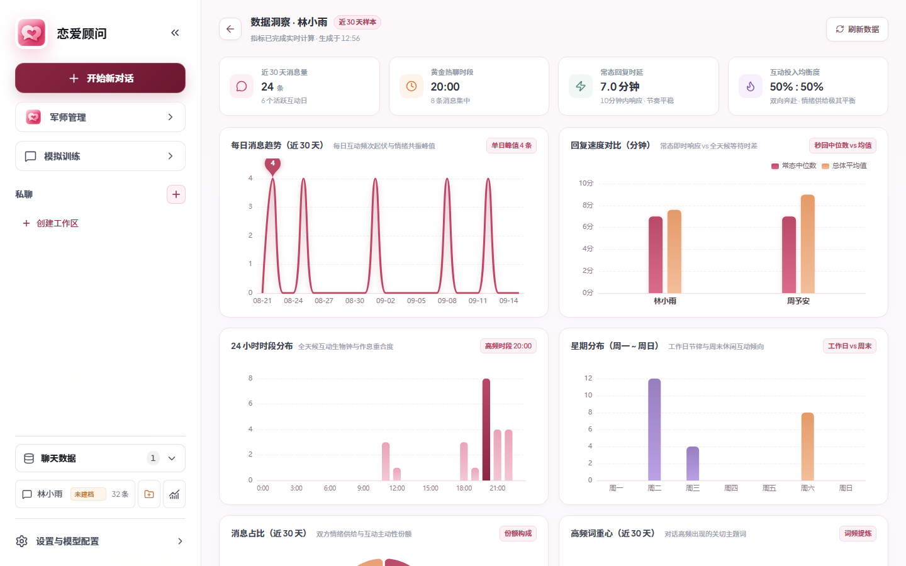

<p align="center">
  
</p>

<h1 align="center">🌸 心迹 · HeartTrace</h1>

<p align="center">
  <strong>原来我才发现，爱能止痛</strong>
</p>

<p align="center">
  一个可以帮你复盘真实聊天记录的AI军师<br />
  并通过模拟真实场景训练聊天技巧
</p>

<p align="center">
  <a href="https://github.com/yjh2222332024/lianai/releases/latest">下载 Windows 便携版</a>
  ·
  <a href="#-快速开始">快速开始</a>
  ·
  <a href="#-本地优先与隐私">隐私说明</a>
</p>

---

## 为什么做心迹？

感情里最难的，往往是建议离你的真实情况太远。

一句“她是不是不喜欢我了？”背后，真正有用的信息可能藏在几个月的聊天节奏里：谁更常主动、回复速度有没有变化、最近在聊什么、哪些话题总是被避开、关系里有哪些还没解决的事。

**心迹不只回答你这一句话。**

它试着把一段关系变成一个可以持续理解、持续训练、持续复盘的工作区：



<p align="center">
  
</p>

<p align="center"><sub>双栏对照：左侧核对原始聊天，右侧直接向军师提问。截图使用完全虚构的演示数据。</sub></p>

---

## ✨ 三个核心体验

### 💬 1. 聊天记录分析：先看事实，再谈感觉

把真实 QQ 私聊导入后，心迹会把聊天记录变成包括她的喜好、习惯等内容的个人档案。

你可以看到：

- **近 30 天消息趋势**：互动是在升温、降温，还是只是偶尔出现峰值。
- **回复速度对比**：观察双方常态回复时延，减少某一次“秒回 / 已读不回”带来的误判。
- **24 小时时段分布**：看你们通常在什么时候聊天，互动节奏是否稳定。
- **星期分布与消息占比**：观察双方投入和主动性的变化。
- **高频关键词**：发现最近反复出现在对话里的主题词。
- **聊天记录浏览与搜索**：随时回到原始消息核对上下文，不让 AI 总结脱离证据。

更重要的是，你可以直接在聊天记录里选择一段消息，**带着原始上下文去问军师**。


<p align="center">
  
</p>

<p align="center"><sub>沟通洞察：消息趋势、回复时延、活跃时段与双方投入。截图使用完全虚构的演示数据。</sub></p>

目前支持：

- **QQ 直连导入**：Windows 用户安装并启动 QQ Chat Exporter（QCE）后，可以选择一对一好友私聊并导入。
- **JSON 文件导入**：导入 QQ 或标准 ChatLab 格式的聊天记录，并在写入前预览消息数量与重复情况。
- **同一工作区更新**：重新上传最新聊天记录，继续沿用原有关系工作区。
- **一对一关系优先**：群聊会被拦截，避免多人语境污染关系分析。

### 🎭 2. 重要的话，先在训练场里说一遍

很多建议看起来都对，真正到了聊天框里却完全说不出口。

心迹内置了一个**基于真实关系档案的模拟训练场**。系统会根据当前工作区里的关系信息生成角色与场景，尽量还原“这个人可能会怎么聊”。

模拟会参考：

- 对方的人物画像、性格特征与沟通习惯
- 常见回复风格、句子长度、表达方式与互动节奏
- 喜好、雷区与已经确认的关系边界
- 你自己的目标、沟通风格和容易重复犯的错误
- 关系阶段、关键事件、未完结事项和近期聊天证据

训练场景由模型根据当前关系动态生成。对方会先发消息，并可以模拟等待、一次分多条回复，以及有限次数的主动补发，让整局更接近日常即时聊天。

你还可以随时：

- **给个提示**：让军师告诉你这一步应该注意什么。
- **暂停点评**：临时停局，分析刚才哪里处理得好、哪里容易踩坑。
- **继续实战**：带着提示回到对话。
- **结束复盘**：让军师对整局训练做总结。
- **选择军师**：在开始一局训练前，选择希望采用的方法论和点评风格。

**真正想发出去的话，可以先在这里试错。**

### 🧠 3. 个性化军师分析：让建议真正进入你的关系上下文

每一段关系都可以建立独立工作区。军师分析时，可以结合工作区里已经沉淀的长期上下文：

| 维度 | 可以记录的内容 |
| --- | --- |
| 对方 | 人物画像、特征、喜好、雷区、沟通方式、回复风格 |
| 自己 | 当前目标、表达习惯、容易重复犯的错误 |
| 关系 | 阶段、背景摘要、关键事件、未完结事项、明确边界 |
| 证据 | 近期聊天、统计数据、异常互动窗口、高信号关键词 |
| 记忆 | 从分析中提出、经用户确认后保存的长期记忆 |

这意味着同一句“我要不要再发一条？”，在不同关系、不同阶段、不同聊天历史里，可以得到完全不同的分析路径。

#### 你还可以拥有不同的“军师”

心迹的军师支持自由组合与扩展，你可以：

- 使用并修改默认情感军师的系统提示词；
- 导入符合规范的 `.zip` 军师包；
- 为自定义军师提供 `SKILL.md`、边界、表达风格和方法论文档；
- 在聊天和模拟训练中切换不同军师。

仓库同时提供军师制作 Skill，帮助你把自己的方法论整理为可校验、可导入的军师包。

---

## 🧭 一次完整的使用流程

1. **导入一段真实私聊**
2. **浏览数据洞察**，先了解互动频率、回复速度和聊天节奏
3. **建立关系工作区**，确认双方身份和自动生成的档案草稿
4. **直接问军师**，让建议结合关系档案和聊天证据
5. **遇到关键对话时进入模拟训练**，先练，再发
6. **在普通军师咨询中确认值得记住的结论**，让后续分析越来越贴近这段关系

---

## 🛡️ 边界与安全

心迹的目标是帮助你理解关系、改善沟通，并把尊重边界放在关系推进之前。

项目内置安全规则，明确反对：

- PUA、情绪操控与欺骗性策略
- 跟踪、骚扰、越界纠缠
- 把对方的拒绝解释成“欲擒故纵”
- 为了所谓“推进关系”而无视已经表达的边界

**明确的拒绝就是边界。安全优先于关系推进。**

---

## ⚡ 快速开始

### Windows 便携版（推荐）

1. 打开 [GitHub Releases](https://github.com/yjh2222332024/lianai/releases/latest)。
2. 下载 `Love-Advisor-*-windows-portable.zip` 并完整解压。
3. 双击 `启动恋爱军师.bat`。

便携版已包含 Node.js 运行时与生产依赖，无需安装 npm，也不需要首次联网安装。启动后浏览器会自动打开：

```text
http://127.0.0.1:3111
```

QQ 直连依赖单独安装的 **QQ Chat Exporter（QCE）**，它不包含在便携包中。没有安装 QCE 时，仍可通过 JSON 文件导入聊天记录。

### 其他系统

下载 Release 中的 `love-advisor-*.tgz`，安装 Node.js 22.19 或更高版本后执行：

```bash
npm install -g ./love-advisor-0.1.0.tgz
love-advisor
```

其他系统可以使用 JSON 文件导入；QCE 自动启动功能目前仅支持 Windows。

常用选项：

```text
love-advisor --help

-p, --port <port>   指定服务端口（默认: 3111）
--host <host>       指定监听地址（默认: 127.0.0.1）
--no-open           启动后不自动打开浏览器
-v, --version       查看版本号
-h, --help          查看帮助
```

### 使用虚构演示数据

源码仓库的 [`love-advisor/examples/`](./love-advisor/examples/) 提供一份完全虚构的标准 ChatLab 私聊记录。它不会覆盖真实聊天，可用于体验浏览、洞察和工作区流程。克隆仓库并安装依赖后执行：

```bash
git clone https://github.com/yjh2222332024/lianai.git
cd lianai/love-advisor
npm install
npx --no-install clb import examples/恋爱军师-演示聊天记录.json --format chatlab --session-id love-advisor-demo-lin
```

然后启动应用：

```bash
npm run build
npm start
```

导入后刷新页面，在私聊列表中选择「林小雨」即可。README 中的产品截图全部来自这份演示数据。

---

## ⚙️ 配置 AI 模型

首次打开后，进入 **设置与模型配置**，填写一个 OpenAI 兼容模型服务：

- **API 地址**，例如 `https://api.deepseek.com/v1`
- **API Key**
- **模型名称**，例如 `deepseek-chat`

你可以自行选择兼容的模型服务，例如 OpenAI、DeepSeek、通义千问、Kimi 等。API Key 会保存在系统用户数据目录的 `settings.json` 中，并在调用模型时作为认证信息发送给你配置的服务。

---

## 🛠️ 本地开发

```bash
git clone https://github.com/yjh2222332024/lianai.git
cd lianai/love-advisor

npm install
npm test
npm run dev:all
```

生产构建与启动：

```bash
npm run build
npm start
```

主要技术栈：

- Vue 3 + Vite
- Express 5
- Tailwind CSS
- ECharts
- ChatLab CLI
- OpenAI-compatible LLM API

---

## 🌱 项目定位

心迹（HeartTrace）定位为一个 **关系理解与对话训练工作台**：把聊天证据、关系档案、军师分析和场景训练放进同一个持续演进的工作区。

它想做的是三个连续动作：

> **看懂已经发生的事 → 演练接下来可能发生的事 → 做出更清醒的决定。**

如果它最后能让你少一点脑补，多一点证据；少一点临场慌乱，多一点准备；少一点套路，多一点尊重，那么这个项目就已经很有价值了。

---

## 📄 License

心迹（HeartTrace）代码以 [MIT License](./love-advisor/LICENSE) 开源。项目依赖 `chatlab-cli`，其自身采用 AGPL-3.0；发布、分发或二次开发前请自行确认适用的许可证义务。
